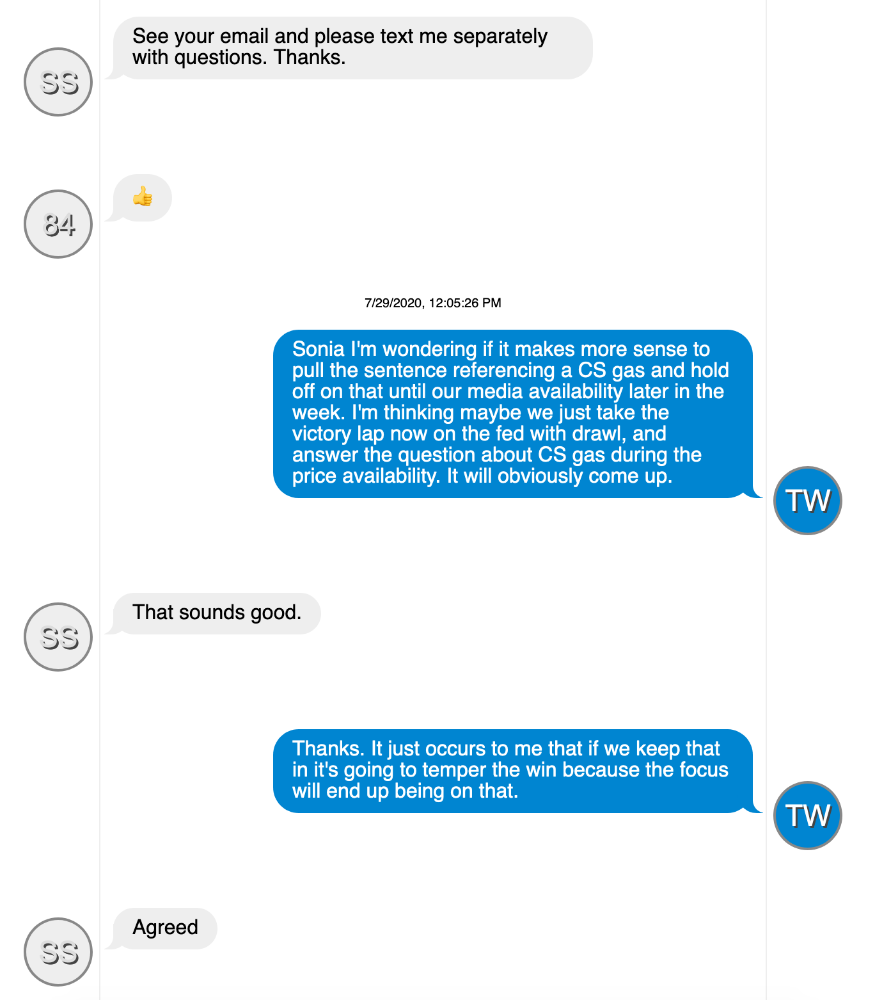

Black Lives Matter!

Txtfier helps make sense of the responses to Portland FOIA requests for text messages.

It creates an interactive HTML page in a format similar to a cell-phone text message.
  - It includes a built-in contact manager. You can add your own contacts as numbers are identified. 
  - It adds tooltips with additional information.
  - There are a number of formatting rules to help readability.

An example looks like this:

Pull requests are encouraged.

You can [make your own FOIA requests](https://www.portlandoregon.gov/66961).

